# AWS Three Tier Web Architecture

## Description:

When building a cloud-based application, the underlying architecture and environment are just as critical as the application itself. There are many considerations when deciding on the proper architecture of your app:

**Scalability**: How easily and/or frequently does the app need to scale up or down? How much value do you put into not having to constantly micro-manage and monitor resource usage?

**Availability**: How readily available is your app? How important is being able to go through long periods of time without failures? If failure does occur in a part of your app, how vulnerable is the rest?

**Security**: How secure is your app? How does your app handle security permissions for different parts of your app? If an attack happens in one part of your app, how vulnerable is the rest?

## Pre-requisites:

1. An AWS account. If you don’t have an AWS account, follow the instructions [here](https://aws.amazon.com/console/) and
   click on “Create an AWS Account” button in the top right corner to create one.
1. IDE or text editor of your choice.

## Audience:

It is intended for those who have a technical role. The assumption is that you have at least some foundational aws knowledge around VPC, EC2, RDS, S3, ELB and the AWS Console.

## Pre-requisites:

1. An AWS account. If you don’t have an AWS account, follow the instructions [here](https://aws.amazon.com/console/) and
   click on “Create an AWS Account” button in the top right corner to create one.
1. IDE or text editor of your choice.

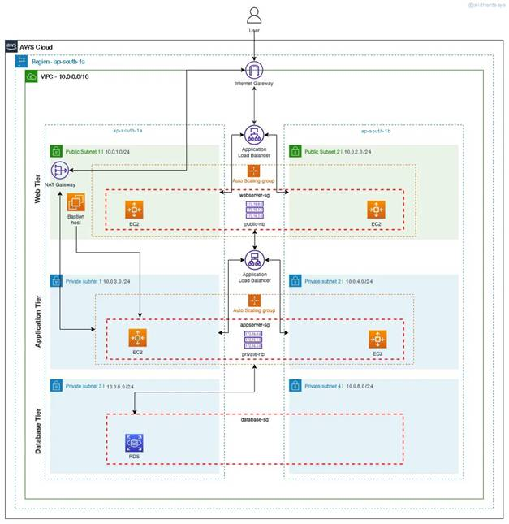

## Let's  started!

### Step 1 Creating VPC

We will start with creating a dedicated VPC.

1\. Open AWS Management Console and enter VPC in the search bar. Then click on VPC to navigate to the VPC Dashboard.

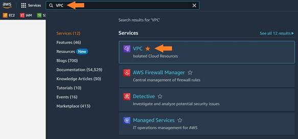

2\. Click on “Create VPC”.

3\. Choose VPC only option and provide a name “Blog-VPC”. Then enter CIDR Block as “10.10.0.0/16” and choose default for tenancy. Tag is optional and hit on Create VPC.

 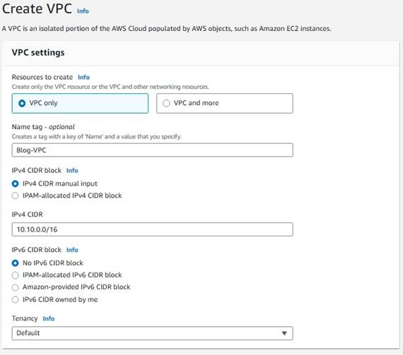

### Step 2 Creating Subnets

We will create subnets for the VPC.

1\. While still on VPC service, click on subnets on the left pane.

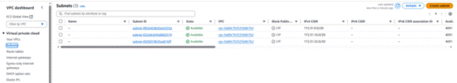

2\. Click create subnet and then create 4 subnets with the following features (Once you enter info for one subnet, click on Add new subnet to open additional fields to enter new subnet information):

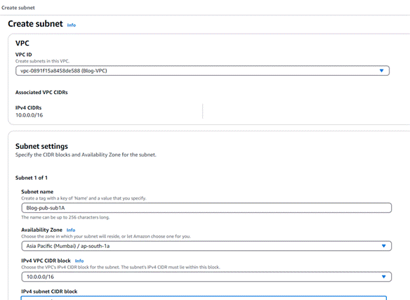

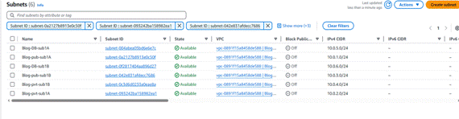

### Step 3 Creating Internet Gateway

We will create an Internet gateway to establish communication between instances in our VPC and the Internet.

1\. While still on VPC service, click on Internet Gateway on the left pane and then click on Create Internet Gateway.

2\. Enter Blog-IGW for the name and hit on Create Internet Gateway.

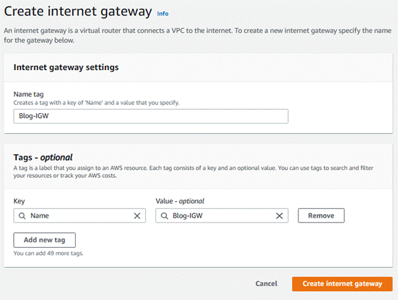

3\. You will see a green banner indicating the creation of the Internet Gateway. Click on “Attach to a VPC” on that banner.

4\. Choose your VPC from the Available VPCs and click on Attach internet gateway.

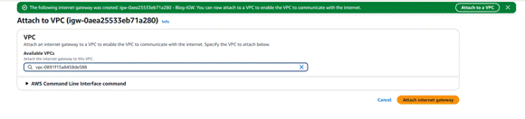

### Step 4 Creating Route Tables

Route tables control the traffic flow between subnets within the VPC and to and from the internet. A route table contains a set of rules, or routes, that specify how traffic should be directed from one subnet to another, or to an external destination. Therefore, we need to create route tables for the newly created Internet gateway.

1\. Select Route Tables from the left pane.

2\. You will see two route tables (unless you had created more before). The default route table is attached to the default internet gateway. We will not touch it. What we will do is to manage the other one.

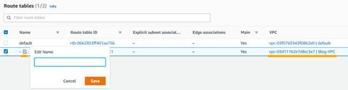

3\. Check the line that belongs to Blog-VPC, click on the edit name icon and add “Blog-public-RT” and click on save. When we created the internet gateway, it created a public route table automatically. We just renamed it to keep track of our resources.

4\. By default, Blog-public-RT only has local network enabled. We will modify it to have internet connectivity. Therefore, click on Blog-public-RT and when it opens, click on Edit routes on the right.

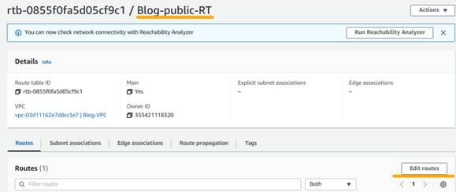

5\. Click on Add route and enter 0.0.0.0/0 for Destination. Then choose Internet Gateway from the Target dropdown list. You will be presented with the newly created internet gateway, select it and click on save changes.

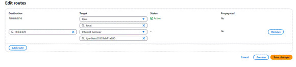

6\. Go back to Route tables menu from the left pane and click on Create Route Table on the right. Then enter Blog-private-RT as name, choose Blog-VPC from the VPC list and click on Create route table to create the private route table.

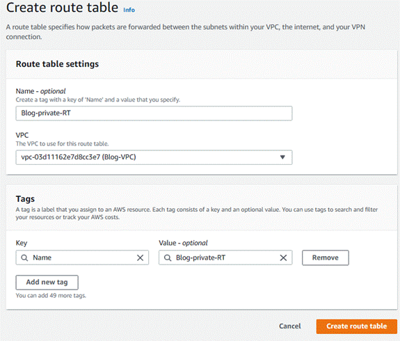

7\. Now we have two route tables (public and private) but we have to associate them with the subnets we created earlier. First, select the Blog-public-RT by clicking on it and then select Subnet associations tab.

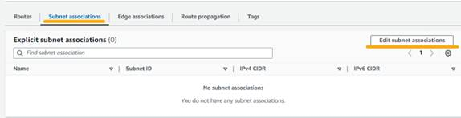

8\. Go back to Route tables and select Blog-private-RT. Then choose Subnet associations tab. Finally, check the private subnets from the list and click on Save associations.

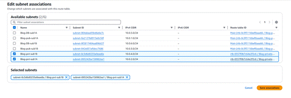

### Step 5  Create a NAT Gateway

A NAT gateway allows instances from the private subnets to connect to resources outside of the VPC and the Internet (for necessary services such as patches or package updates).

It’s best practice to maintain high availability and deploy two NAT gateways in our public subnets (one in each Blog-); however, for now, we will just deploy one.

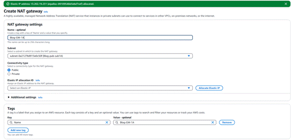

Navigate to ‘_NAT Gateways_’ and create a new gateway called **Blog-GW-1A**. Select one of the public subnets, allocate an elastic IP, and create the gateway.

## Tier 1: Web tier (Frontend)

The **Web Tier**, also known as the **Presentation Layer**, is where the user-facing part of our **Blog** lives — this is what visitors will see and interact with. We start by creating a **launch template**, which acts as a blueprint for launching our EC2 web servers. It includes details like the operating system (Amazon Linux 2), instance type (like t2.micro), security group settings, and key pair for secure access.

Next, we set up an **Auto Scaling Group (ASG)**. This automatically adds more EC2 instances when traffic increases and removes them when traffic is low, ensuring that your blog runs smoothly while keeping costs under control.

Finally, we add an **Application Load Balancer (ALB)**. This smart tool directs incoming web traffic to the different EC2 instances evenly, preventing any single server from getting overwhelmed and improving both performance and reliability.

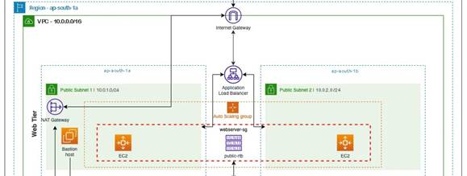

Let’s set up the basic instructions for AWS on **how to launch our web servers**. This template will be used by our Auto Scaling Group to automatically spin up new instances when needed.

Here’s how to do it:

1.      Head over to the **EC2 Dashboard** in the AWS Console.

2.    On the left sidebar, find and click on **“Launch Templates”** under the "Instances" section.

3.    Click **“Create launch template”** and name it something like blog-webServer.

Now fill in the details:

·         **AMI (Amazon Machine Image):** Choose **Amazon Linux 2**

·         **Instance type:** Select **t2.micro** — this one is small, budget-friendly, and covered in the Free Tier

·         **Key Pair:** Pick an existing key pair (or create a new one) — this lets you securely connect to your server later if needed

·         **Security Group:** Create a new one and make sure to allow:

o    **SSH (port 22)** – for secure access

o    **HTTP (port 80)** – for regular web traffic

o    **HTTPS (port 443)** – for secure web traffic

·         Lastly, double-check that you’ve selected the correct **VPC** for your blog project.

No need to assign subnets here — we’ll take care of that later when we set up the Auto Scaling Group.

Done! You’ve just created a ready-to-go blueprint for launching web servers.

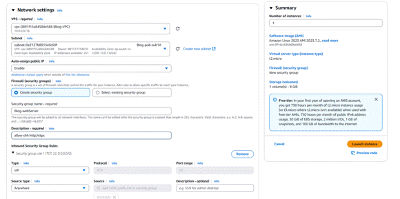

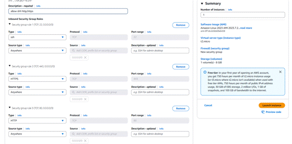

Under ‘_Advanced details > User data,_’ we need to paste in our script that installs an Apache web server and a basic HTML web page. You can view the specific script (script [here](file:///C:/Users/Naman/Downloads/bash-scripts-main.zip) or [https://github.com/Sidhant8591/bash\_script.git](https://github.com/Sidhant8591/bash_script.git)).

## 2: Set Up an Auto Scaling Group (ASG)

Now that we’ve got our launch template ready, it’s time to create an **Auto Scaling Group** — this is what makes sure your blog stays up and running even when traffic changes or something goes wrong.

The ASG will **automatically launch EC2 instances** when needed and spread them across multiple Availability Zones (AZs), so your blog doesn’t go offline if one zone has an issue.

Here’s how to do it:

1.       In the AWS Console, go to the **Auto Scaling Groups** section under the EC2 menu.

2.      Click **“Create Auto Scaling group.”**

3.      Give your group a name like `blog-asg`.

4.      Choose the **launch template** we created earlier (e.g. `blog-webServer`).

5.      Select the correct **VPC** for your blog project.

6.      Pick **two public subnets** (in different Availability Zones) so that your EC2 instances can be spread out and more resilient.

That’s it! The ASG will now monitor traffic and **automatically add or remove servers** based on demand — keeping things efficient and reliable without you having to manage everything manually.

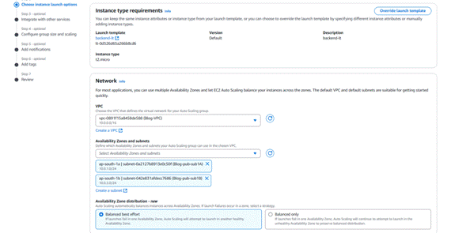

### 3: Set Up an Application Load Balancer (ALB)

Next up, we need an **Application Load Balancer (ALB)** — this acts like a smart traffic manager for your blog. It takes all the incoming web traffic and sends it to the right EC2 instances behind the scenes.

This helps your blog stay fast, balanced, and reliable — especially when lots of people are visiting at once.

#### Here's how to set it up:

1.      In the AWS Console, go to **EC2 > Load Balancers**

2.     Click **“Create Load Balancer”** and choose **Application Load Balancer**

3.     Name it something like “`blog-webServer-alb”`

4.     Set the scheme to **“Internet-facing”** — this makes it public so it can receive HTTP and HTTPS traffic from users

5.     Choose the **VPC** you’ve been using for your blog

6.     Select the **public subnets** (preferably in 2 different Availability Zones)

7.     Under **Listeners**, make sure to add:

o    **HTTP (port 80)**

o    Optionally **HTTPS (port 443)** if you plan to set up SSL

Later, you'll create a **target group** that includes your EC2 instances so the ALB knows where to send the traffic.

And that's it! Your blog now has a powerful traffic director making sure everything flows smoothly, no matter how many visitors show up.

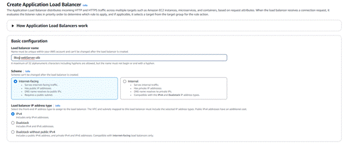

_Note: Creating an ALB From the ASG interface automatically attaches the default security group to our ALB. We need the brainiac-webServer-sg, so after the ASG is complete, we need to go back to the load balancer and make sure the proper security group is attached._

The ALB needs to ‘listen’ over HTTP on port 80 and a target group that routes to our EC2 instances.

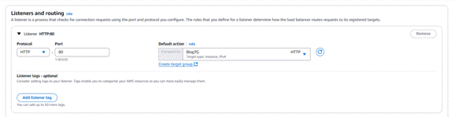**Group size**We want to set a minimum and maximum number of instances the ASG can provision:

·         **Desired capacity:** 2

·         **Minimum capacity:** 2

·         **Maximum capacity:** 5

Review the ASG settings and create the group!

Once the ASG is fully initialized, we can go to our EC2 dashboard and see that two EC2 instances have been deployed.

To see if our ALB is properly routing traffic, let’s go to its public DNS. We should be able to access the website we implemented when creating our EC2 launch template.

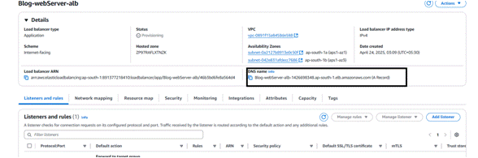

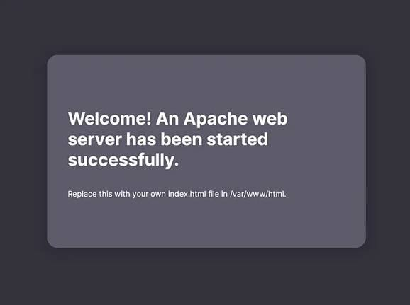

## SSH

Let's confirm that we can SSH into our EC2 server.

## Success!

Awesome job! You’ve just set up the **Web Tier** for your **Blog Demo** — nice work! This layer is all about the **user experience** — it’s what your visitors will see and interact with when they land on your site. From the servers to the load balancer, everything’s in place to deliver your blog smoothly and reliably to the world.

## Tier 2: Application Tier (Backend)

Now that the Web Tier is ready, let’s move to the Application Tier — the backend of your Blog app. This is where all the core logic happens. It's the middle layer that connects the frontend (Web Tier) with the database.

Think of this as the "brains" behind your blog — it processes data, runs the code, and handles communication between the user interface and stored information.

Even though the setup is similar to the Web Tier, this layer has a couple of important extras.

🔧 Here's what we’ll build:

·        **Launch Template**: This will define what kind of EC2 instances our backend servers will use (like OS, size, and access).

·        **Auto Scaling Group (ASG):** Just like in the Web Tier, this helps automatically launch or shut down backend servers based on demand.

·        **Application Load Balancer (ALB):** This one will handle traffic from the Web Tier and forward it to the backend servers in a smart and balanced way.

·        **Bastion Host:** A secure entry point for you (the developer/admin) to connect to your private application servers without exposing them directly to the internet.

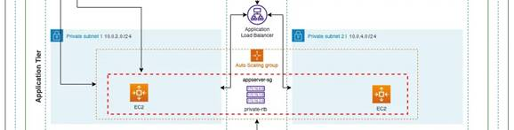

## 1:Create an application server launch template

Let’s build a **launch template** that will define how our **backend (application) servers** should be set up.

Here’s what to do:

1.      Go to the **EC2 Console** and navigate to **“Launch Templates”**.

2.     Click **“Create launch template”** and name it something like “blog-appServer-template”.

For the settings, we’ll **reuse the same ones** we used for the web server:

·         **AMI:** Amazon Linux 2

·         **Instance type:** t2.micro (1GB, Free Tier eligible)

·         **Key pair:** Use the same key pair you used for the Web Tier

But here’s what **changes**:

·         Since these servers will run in a **private subnet**, they won’t be directly exposed to the internet — which is great for security.

·         For the **security group**, create a new one that **does not allow public access**.

·         Instead, allow only:

o    **ICMP – IPv4** from the Web Tier’s security group — this lets the web server **ping** the app server (great for testing connections).

This setup keeps your backend safe while still allowing communication from the Web Tier.

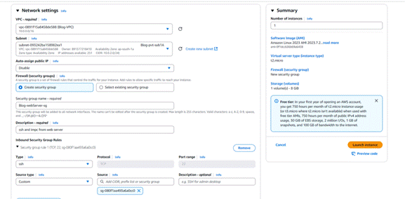

The application servers will eventually need to access the database, so we need to make sure the mySQL package is installed on each instance.

In the ‘_User data_’ field under ‘_Advanced details,_’ paste in this script:

#!/bin/bash  
sudo yum install mysql -y

Review and create the template.

### 2:Create an Auto Scaling Group (ASG)

Just like we did for the Web Tier, we’ll now set up an **Auto Scaling Group (ASG)** to manage our **backend servers**. This group will automatically launch or remove EC2 instances based on your app’s needs — helping with performance and reliability.

### Here's how:

1.       Go to the **Auto Scaling Groups** section in the EC2 Console.

2.      Click **“Create Auto Scaling group”** and name it something like `blog-appServer-asg`.

3.      Choose the **launch template** we just created: `blog-appServer-template`.

4.      Under **Network settings**, select your **Blog VPC**.

5.      For **subnets**, pick the **two private subnets** (like `blog-pvt-sub1a` and `nlog-pvt-sub1b`).

These private subnets keep your application layer protected from direct internet access — but it’ll still be fully functional behind the scenes!

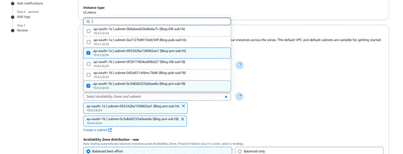

## 3: Create an Internal Application Load Balancer (ALB)

Now it’s time to create another **Application Load Balancer (ALB)** — but this one won’t face the internet.

Instead, this **ALB will be “Internal”** and will handle traffic **from the Web Tier to the App Tier**. It's like a behind-the-scenes traffic router for your backend servers.

#### Here's how to do it:

1.      Go to the **Load Balancers** section in the EC2 Console.

2.     Click **“Create Load Balancer”** and select **Application Load Balancer**.

3.     Name it something like `blog-appServer-alb`.

4.     Set the scheme to **“Internal”** (since it won’t handle public traffic).

5.     Choose your **Blog VPC** and select the **two private subnets** (same ones used in your App Tier).

6.     Under **Listeners**, set it to listen on **HTTP (port 80)** by default.

Later, you’ll link this ALB to a **target group** containing your app EC2 instances so it knows where to send the traffic.

This setup ensures your Web Tier can talk to your backend safely and efficiently — all within the protected boundaries of your VPC

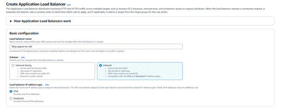

We’ll also create another target group that will target our appServer EC2 instances.

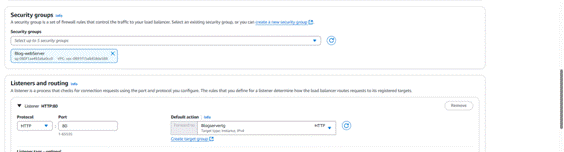

Now we can review our settings and create the group.

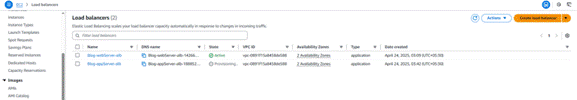

Great! We should see two more EC2 instances running from our private subnets.

## Confirm connectivity from the Web Tier

Our application servers are up and running. Let’s verify connectivity by pinging the application server from one of the web servers.

SSH into the web server EC2 and ping the private IP address of one of the app server EC2s.

ssh -i "blogServer\_key.pem" ec2-user@ec2-54-209-250-120.compute-1.amazonaws.com

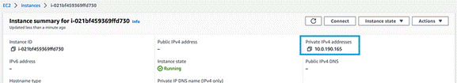

ping PRIVATE\_IPV4\_ADDRESS

If successful, you should get a repeating response like this:

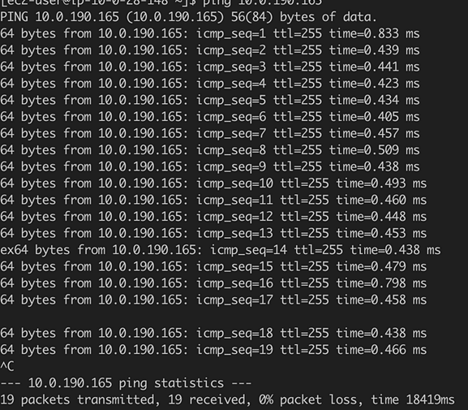

type ^C to terminate the process

Woo! We’ve successfully pinged the app server and received a response!

**Host**

Let's set up a secure gateway to your application servers. Think of a **Host** as a heavily guarded doorkeeper for your private network. It's the _only_ way authorized personnel can get in to manage your other servers, keeping the bad guys out!

Here's how we'll create this 'doorkeeper' in your Web Tier:

1.      **Head over to the EC2 Console:** This is where you manage your virtual servers in the cloud.

2.     **Launch a New Instance:** Click the button to create a new virtual server.

3.     **Give it a Name:** Call this new server blog-Host. This helps you easily identify its purpose.

4.     **Choose the Same Basics:** We'll stick with the same setup as your other servers:

o    **Amazon Linux 2:** This is the operating system.

o    **t2.micro:** This is the size of the server – small and cost-effective for our needs.

5.     **Pick Your Network:** Make sure you select your special network, blog-vpc. This ensures the bastion host is connected to your other resources.

6.     **Place it in the Public:** Importantly, choose one of your **public subnets**. This is crucial because the bastion host needs to be reachable from the outside world so you can connect to it.

That's it! You've just created your blog-bastionHost. Now, instead of directly accessing your application servers, you'll first connect to this bastion host, and then from there, you can securely access your other servers in the private Application Tier. This adds a vital layer of security to your setup! Let me know when you're ready for the next step.

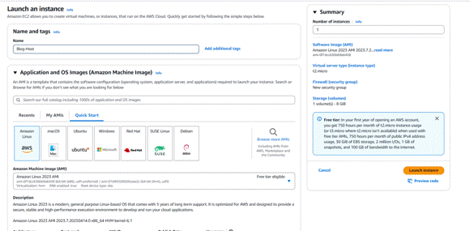

Create a new security group called, ‘**Blog-host-sg,’** and only allow SSH through **My IP.**

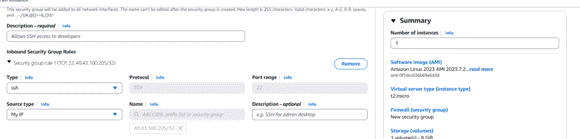

Now we have to edit our inbound rules for the **Blog -appServer-sg** to make sure we’re allowing SSH access ONLY from the host server.

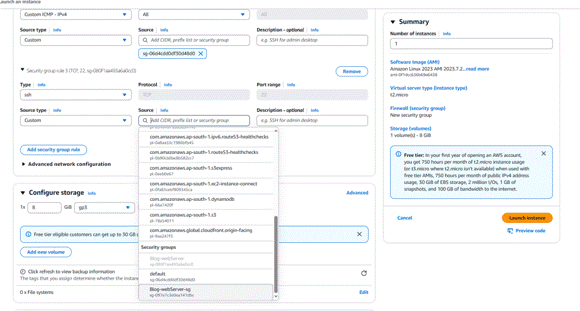

## Test the connection

Let’s see if we can connect to our application server through our host server .

Once the key pair is added to the Agent, SSH into the bastion host.

ssh -A ec2-user@BASTIONHOST\_PUBLIC\_IP

And then SSH into our app server (remember, we need the **private IPv4** address).

\[ec2-user@ip-10-0-28-148 ~\]$ ssh -A ec2-user@APPSERVER\_PRIVATE\_IP

­

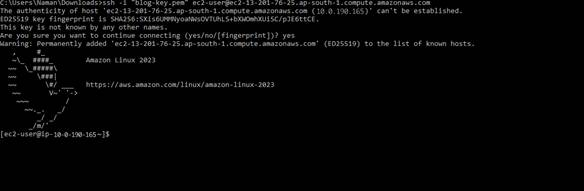

## Success!

You did it! The **Application Tier** for your **Blog** is all set up.

This is the **backend layer** — the place where your app’s core logic and source code live. It handles everything that goes on behind the scenes and connects the Web Tier (frontend) with the Database Tier (data storage). Everything is now working together smoothly!

## Tier 3: Database Tier (Data Storage & Retrieval)

You're almost done! Now it's time to build the final layer of your **Blog app's architecture** — the **Database Tier**.

Every app needs a place to **store and manage important data** like user logins, content, sessions, and more. This tier is where your backend (Application Tier) can **read and write data** to make sure your blog runs smoothly and shows the right info to your users.

We’ll be using **Amazon RDS** with **MySQL** — a popular, fully-managed relational database service that’s secure, reliable, and easy to scale.

###  Here’s what we’ll build:

·         **A Database Security Group**  
To control which traffic is allowed to communicate with the database specifically allowing **MySQL traffic (port 3306)** from the Application Tier.

·         **A DB Subnet Group**  
This tells AWS **where** (in which private subnets) the RDS database should be placed, keeping it secure and isolated.

·         **An RDS Database Instance (MySQL)**  
This is the actual database where all your blog data will be stored and accessed by your backend servers.

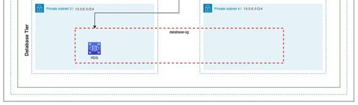

## 1:Create a Database Security Group

Before your database can talk to your app servers, we need to set up a **security group** that allows safe and limited access.

### Here’s what to do:

1.      Go to the **VPC Console** and navigate to **Security Groups**.

2.    Click **“Create security group”** and name it something like `blog-db-sg`.

3.    Choose your **Blog VPC** (same VPC you’ve been using).

Now set up an **inbound rule**:

·         **Type:** MySQL/Aurora

·         **Protocol:** TCP

·         **Port:** 3306

·         **Source:** Select **“Custom”**, and choose the security group you created for your **Application Tier** (e.g., `blog-appServer-sg`)

·          

This allows only your **app servers** to access the database — keeping everything secure and locked down from the outside world.

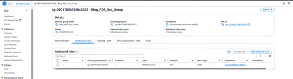

Now, we need to add inbound AND outbound rules that allow MySQL requests to and from the application servers on port 3306.

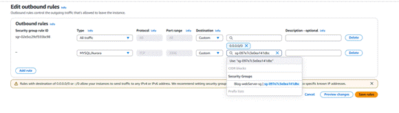

## 2:Create a DB Subnet Group

To make sure your database is placed in the **right private subnets**, we need to create a **DB subnet group**. This tells RDS where it’s allowed to launch the database within your VPC.

### Follow these steps:

1.       Open the **RDS Console**.

2.      In the left sidebar, scroll down and click on **“Subnet groups”** under the **“Subnet & security”** section.

3.      Click **“Create DB Subnet Group”**.

4.      Name it something like `blog-db-subnetGroup`.

5.      Select your **Blog VPC**.

Then:

·         Choose **two private subnets** (from different Availability Zones) where your database should live.

·         Add them to the group.

This setup keeps your database secure and ensures high availability by placing it in multiple AZs.

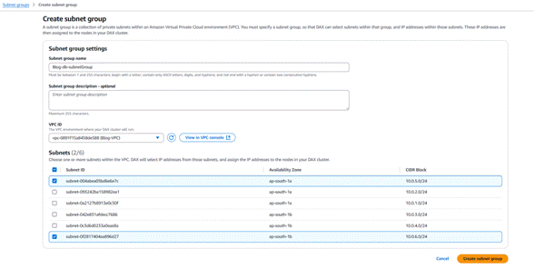

From our earlier diagram, we want our **database to be in private subnets**, starting with something like `subnet-private3`, and spread across **multiple Availability Zones (AZs)** for high availability.

Since you’re working in the **Asia Pacific (Mumbai)** region (`ap-south-1`), your AZs might be:

·         `ap-south-1a`

·         `ap-south-1b`

#### Here's what to do:

1.       While creating the **DB Subnet Group** in the RDS console:

o    Choose your **Blog VPC**.

o    Pick **two private subnets** — e.g., `subnet-private3` and `subnet-private4`.

2.      The dropdown won't show subnet **names**, only **subnet IDs**, which can be confusing.

**Pro Tip:** Open a second tab with the **VPC > Subnets** section, find the **subnet IDs** for `subnet-private3` and `subnet-private4`, and copy-paste them back into the subnet group form.

This step ensures your **MySQL RDS instance** is deployed in the right secure zones and is resilient across multiple AZs.

## 3: Create an RDS Database

Now that everything’s set up, it’s time to actually **create the database** that your app will use to store and retrieve data.

### Here's how to do it:

1.      Go to the **RDS Console**.

2.     In the left sidebar, click on **“Databases”**.

3.     Click the **“Create database”** button.

### Choose the following options:

·         **Engine type:** MySQL

·         **Template:** Free tier (if you're eligible)

·         **DB Instance identifier:** Something like `blog-db`

·         **Username:** Choose your master username (e.g., `admin`)

·         **Password:** Set a strong password and save it safely!

### Under Connectivity:

·         **VPC:** Select your **Blog VPC**

·         **DB Subnet Group:** Choose the `blog-db-subnetGroup` you created earlier

·         **Public access:** **No** (since we want the DB in private subnets)

·         **VPC security group:** Select the `blog-db-sg` security group

Once everything looks good, click **“Create database”** at the bottom.

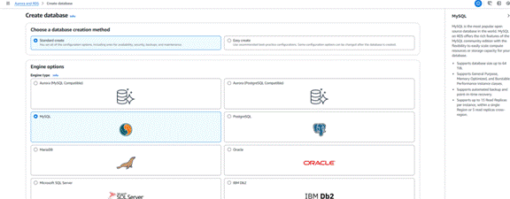

For our purposes, we’ll stick to the ‘_Free tier_’ option.

_If we were to use this database for production/dev environments, it’s best practice to enable Multi-AZ deployment for higher availability, but this does incur a cost. Multi-AZ deployments allow us to create a ‘Standby’ or ‘Failover’ database that serves as a back-up, should something happen to our main instance or AZ. It also allows us to create a ‘read-replica’ database, which, essentially, is a read-only version of our DB and allows for more efficient queries from the Application Tier__._

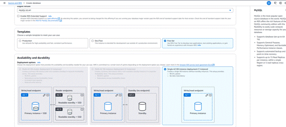

We’ll name our database **blog-webApp-db** — this will be the central storage for our app's data.

When setting it up, you’ll also need to:

·         **Create a Master Username** (e.g., admin)

·         **Set a strong Master Password**

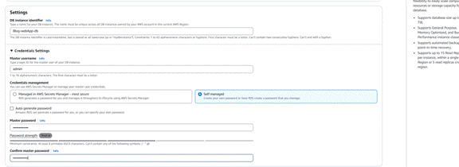

_For the RDS setup, choose_ `**_db.t2.micro_**` _as the instance type (great for Free Tier) and keep the default storage settings. Under_ **Connectivity**_, don’t connect to an EC2 instance—just be sure to select your_ `**_blog-vpc_**` _so the database stays in the correct private network. This ensures your database is both efficient and secure._

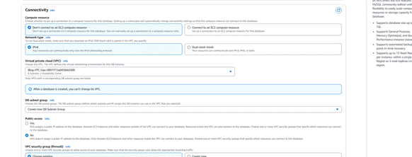

Select the `**blog-db-sg**` security group to control access to your database. For Availability Zone, pick `**ap-south-1a**` (or your preferred AZ in Mumbai region). This setup helps ensure that only your application servers can connect to the database, keeping things secure and isolated.

Under ‘_Additional configuration,_’ repeat the name of the database you created in the first step (without dashes).

Leave the defaults for everything else and create the database (this may take a few minutes to fully provision).

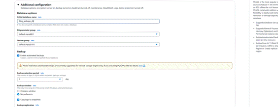

## Connect to the Database

After the DB has been created, we’ll need the database endpoint to establish a connection from the app server.

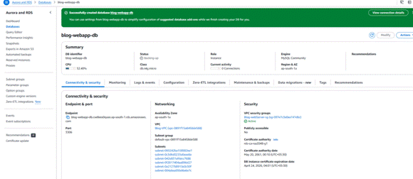

If you haven't yet, SSH into the app server through our bastion host.

We should already have mySQL installed on the server, so we can run this command:

mysql -h YOUR\_DB\_ENDPOINT -P 3306 -u YOUR\_DB\_USERNAME -p

When prompted, enter the password you chose when creating the DB.

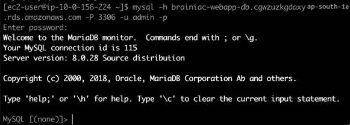

Great! We successfully connected to our database from our application server!

## Success!

  
That was a solid effort! It might’ve seemed like a lot, but by breaking it down step-by-step, we made it through. You’ve now built a **highly available, secure, and scalable 3-tier architecture**—fully ready to support your **Blog app** on AWS.

## Cleanup Checklist

Before you call it a day, make sure to **delete the following**:

·         **Auto Scaling Groups (ASG)**

·         **Application Load Balancers (ALB)**

·         **RDS Database instances**

·         **NAT Gateways**

·          **EC2 Instances**

·         **Elastic IPs** (be sure to release them!)

·         **VPC**

_Tip: Always double-check the_ **Billing Dashboard** _after cleanup to ensure nothing is still running._

Done right, and you're good to go without any unexpected AWS bills. Let me know  if you want a script or guide for clean-up!

**Thank you!**

Thank you for following me on my cloud computing journey. I hope this article was helpful and informative.
